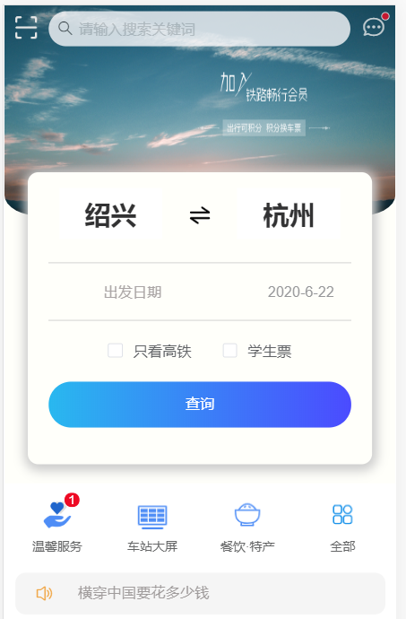
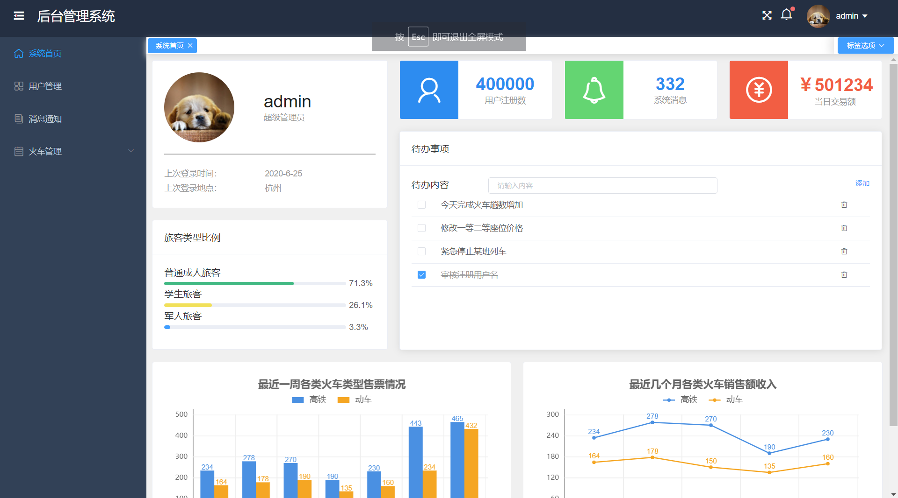

## 火车售票系统

:blush:本系统使用了Vue作为前端框架，Vant组件和element ui作为前端前端UI，后端使用了springboot和Mybatis，数据库使用了Mysql关系型数据库，具有用户移动端和web管理端两个终端。

----------
##### :100: 模块介绍

train模块为后端项目，支持用户前端和管理后台的api请求；train-user为前端用户项目；vue-manage-system为管理后台项目，使用[后台模板](https://github.com/lin-xin/vue-manage-system)魔改的。

----------
##### :hammer:系统主要功能

- [x] 火车票预订
- [x] 火车票改签
- [x] 火车票退票
- [x] 车票节假日价格浮动
- [x] 火车发布和新增

_:wrench:这次项目只做了简单的售票业务，而且假设每辆火车只有起点和终点，为了方便移植和编写，项目只用了Mysql数据库，不过Mysql做了很多底层代码，创建了视图、存储过程和一些触发器，另外项目还有很多待优化的地方，管理员界面套用了vue后台管理模板，在基础业务外还可以添加很多功能。_

-----------

##### 需要的环境和软件:rainbow::

> 1. node
> 2. maven
> 3. mysql8.0
> 4. Vscode
> 5. Intellij IDEA

##### 帮助过程:trophy:

1. 安装启动数据库Mysql8.0，打开可视化工具将train.sql数据库脚本文件导入(不要直接运行脚本，在Navicat右键运行SQL文件，或者在DBeaver新建train，如何右键train数据库>工具>Restore database)。
2. 启动服务端，安装打开Intellij IDEA软件，导入train项目文件夹，找到application.yml文件修改数据库连接配置(配置为自己环境的数据库连接配置)，完成后启动项目。
3. 打开Vscode，导入vue-manage-system和train-user项目，代开vue.config.js文件可以进行端口号的修改，然后执行npm install安装依赖，最后执行npm run serve 运行程
4. 管理员默认账号密码admin和123456，用户端已存在测试账号密码 匿名用户和123456
5. 有些数据已经过期可以根据需求删减，火车查询列次是只能查询当前时间之后的火车班次

-----

:black_nib:下面展示两个终端的主页​

